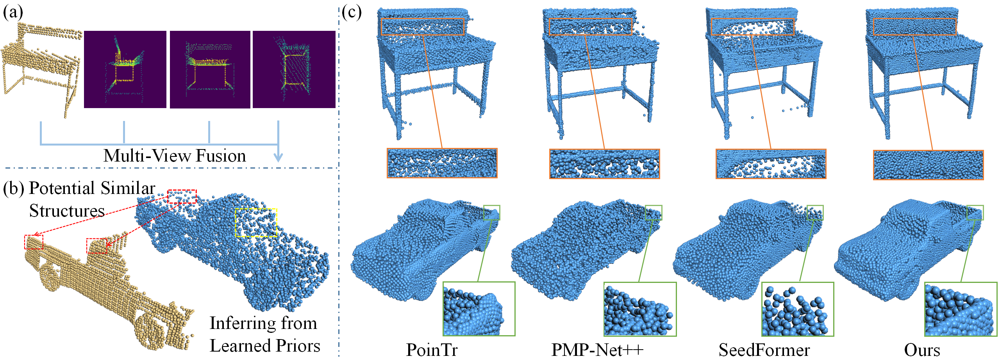

# SVDFormer: Complementing Point Cloud via Self-view Augmentation and Self-structure Dual-generator

This repository contains the PyTorch implementation of these papers:

> [**SVDFormer: Complementing Point Cloud via Self-view Augmentation and Self-structure Dual-generator**](https://arxiv.org/abs/2307.08492)           
> [Zhe Zhu](https://scholar.google.com/citations?user=pM4ebg0AAAAJ), [Honghua Chen](https://chenhonghua.github.io/clay.github.io/), Xing He, Weiming Wang, Jing Qin, [Mingqiang Wei](https://scholar.google.com/citations?user=TdrJj8MAAAAJ)      
> **ICCV 2023**

> [**PointSea: Point Cloud Completion via Self-structure Augmentation**](https://arxiv.org/abs/2502.17053)           
> [Zhe Zhu](https://scholar.google.com/citations?user=pM4ebg0AAAAJ), [Honghua Chen](https://chenhonghua.github.io/clay.github.io/), Xing He, [Mingqiang Wei](https://scholar.google.com/citations?user=TdrJj8MAAAAJ)       
> **IJCV 2025, journal extension of SVDFormer**



## Abstract

> In this paper, we propose a novel network, SVDFormer, to tackle two specific challenges in point cloud completion: understanding faithful global shapes from incomplete point clouds and generating high-accuracy local structures. Current methods either perceive shape patterns using only 3D coordinates or import extra images with well-calibrated intrinsic parameters to guide the geometry estimation of the missing parts. However, these approaches do not always fully leverage the cross-modal self-structures available for accurate and high-quality point cloud completion. To this end, we first design a Self-view Fusion Network that leverages multiple-view depth image information to observe incomplete self-shape and generate a compact global shape. To reveal highly detailed structures, we then introduce a refinement module, called Self-structure Dual-generator, in which we incorporate learned shape priors and geometric self-similarities for producing new points. By perceiving the incompleteness of each point, the dual-path design disentangles refinement strategies conditioned on the structural type of each point.
SVDFormer absorbs the wisdom of self-structures, avoiding any additional paired information such as color images with precisely calibrated camera intrinsic parameters. Comprehensive experiments indicate that our method achieves state-of-the-art performance on widely-used benchmarks.

## Dense PointMap: leveraging both image and point structure

This fork adds a **Dense PointMap** self-projection to the PointSea/SVDFormer
pipeline. Instead of collapsing each view into a single-channel depth image
(`[H, W, 1]`), we keep the full 3D coordinate of every projected point plus a
validity mask (`[H, W, 3 + 1]`). The resulting map is thus an **image** (a
regular H×W grid) *and* a **dense point cloud** at the same time, so the network
can exploit both 2D image structure and complete 3D geometry, without the
sparsity of voxels.

### Results (Completion3D validation, 800 shapes, small 5.05M backbone)

| Method | CD (×1000) ↓ | DCD ↓ | F1 ↑ | best epoch |
| --- | --- | --- | --- | --- |
| PointSea (depth map) | 27.42 | 0.727 | 0.209 | 11 |
| **Dense PointMap** | **18.74** | **0.677** | **0.318** | 26 |

Dense PointMap reaches **~32% lower Chamfer Distance** and **~52% higher F1**
than the depth-map PointSea baseline, and trains more stably (PointSea overfits
after epoch 11, while Dense PointMap keeps improving up to epoch 26).

### Reproduce

Both methods are trained/evaluated with `train_unified.py` on the Completion3D
split — set `__C.DATASETS.COMPLETION3D.ROOT` in `config_completion3d.py` to your
data path. All runs use the 5.05M-parameter `small` backbone, batch size 12,
Adam (lr 1e-4), `merge_points=256`, 30 epochs.

```bash
# PointSea baseline (single-channel depth self-projection)
python train_unified.py --method pointsea --model small \
    --epochs 30 --batch_size 12 --output_dir pointsea_small

# Dense PointMap (full 3D-coordinate self-projection)  -> best val CD
python train_unified.py --method dense_pointmap --model small \
    --epochs 30 --batch_size 12 --output_dir densemap_small

# Evaluate a saved checkpoint on the test split
python train_unified.py --test --method dense_pointmap --model small \
    --weights densemap_small/checkpoints/<timestamp>/ckpt-best.pth

# Optional: dilated-backbone variant (isolated model class)
python train_unified.py --method dense_pointmap --model dilated --dilation 2 \
    --epochs 30 --batch_size 12 --output_dir dil2_dense_pointmap
```

Every training run prints a per-category table plus an `Overall` row
(CD / DCD / F1) on the validation split at the end of each epoch, and saves the
best validation CD to `checkpoints/<timestamp>/ckpt-best.pth`. See
[`docs/dense_pointmap_architecture.md`](docs/dense_pointmap_architecture.md) for
the architecture and design details.

## Pretrained Models
We provide pretrained SVDFormer models on PCN and ShapeNet-55/34 [here](https://drive.google.com/drive/folders/1qO1TAB-C2OOMKrUSoGUGY-nhThbBgQ5i?usp=drive_link).


## Get Started

### Requirement
- python >= 3.6
- PyTorch >= 1.8.0
- CUDA >= 11.1
- easydict
- opencv-python
- transform3d
- h5py
- timm
- open3d
- tensorboardX

Install PointNet++ and Density-aware Chamfer Distance.
```
cd pointnet2_ops_lib
python setup.py install

cd ../metrics/CD/chamfer3D/
python setup.py install

cd ../../EMD/
python setup.py install
```


### Dataset
Download the [PCN](https://gateway.infinitescript.com/s/ShapeNetCompletion) and [ShapeNet55/34](https://github.com/yuxumin/PoinTr) datasets, and specify the data path in config_*.py (pcn/55).
```
# PCN
__C.DATASETS.SHAPENET.PARTIAL_POINTS_PATH        = '/path/to/ShapeNet/%s/partial/%s/%s/%02d.pcd'
__C.DATASETS.SHAPENET.COMPLETE_POINTS_PATH       = '/path/to/ShapeNet/%s/complete/%s/%s.pcd'

# ShapeNet-55
__C.DATASETS.SHAPENET55.COMPLETE_POINTS_PATH     = '/path/to/shapenet_pc/%s'

# Switch to ShapeNet-34 Seen/Unseen
__C.DATASETS.SHAPENET55.CATEGORY_FILE_PATH       = '/path/to/datasets/ShapeNet34(ShapeNet-Unseen21)'
```
### Evaluation
```
# Specify the checkpoint path in config_*.py
__C.CONST.WEIGHTS = "path to your checkpoint"

python main_*.py --test (pcn/55)
```

### Training
```
python main_*.py (pcn/55) 
```

## Citation
```
@InProceedings{SVDFormer,
    author    = {Zhu, Zhe and Chen, Honghua and He, Xing and Wang, Weiming and Qin, Jing and Wei, Mingqiang},
    title     = {SVDFormer: Complementing Point Cloud via Self-view Augmentation and Self-structure Dual-generator},
    booktitle = {Proceedings of the IEEE/CVF International Conference on Computer Vision (ICCV)},
    month     = {October},
    year      = {2023},
    pages     = {14508-14518}
}
@article{PointSea,
  title={PointSea: Point Cloud Completion via Self-structure Augmentation},
  author={Zhu, Zhe and Chen, Honghua and He, Xing and Wei, Mingqiang},
  journal={International Journal of Computer Vision},
  volume={133},
  number={7},
  pages={4770--4794},
  year={2025}
}
```


## Acknowledgement
The repository is based on [SnowflakeNet](https://github.com/AllenXiangX/SnowflakeNet), some of the code is borrowed from:
- [PytorchPointNet++](https://github.com/erikwijmans/Pointnet2_PyTorch)
- [Density-aware Chamfer Distance](https://github.com/wutong16/Density_aware_Chamfer_Distance)
- [PoinTr](https://github.com/yuxumin/PoinTr)
- [GRNet](https://github.com/hzxie/GRNet)
- [PointAttN](https://github.com/ohhhyeahhh/PointAttN)
- [SimpleView](https://github.com/princeton-vl/SimpleView)

The point clouds are visualized with [Easy3D](https://github.com/LiangliangNan/Easy3D).

We thank the authors for their great work！

## License

This project is open sourced under MIT license.


