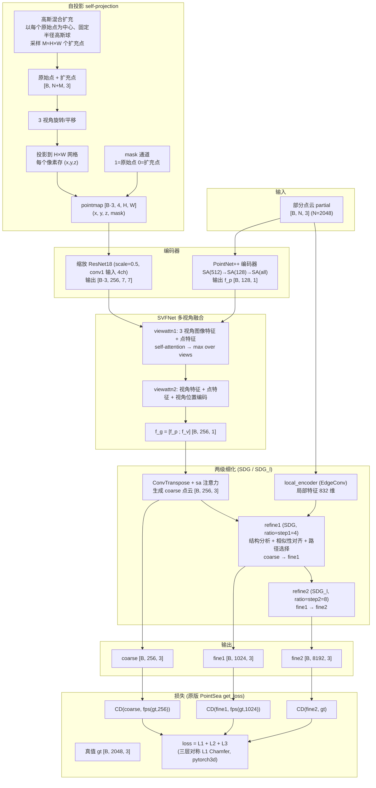
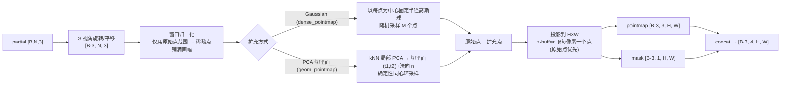
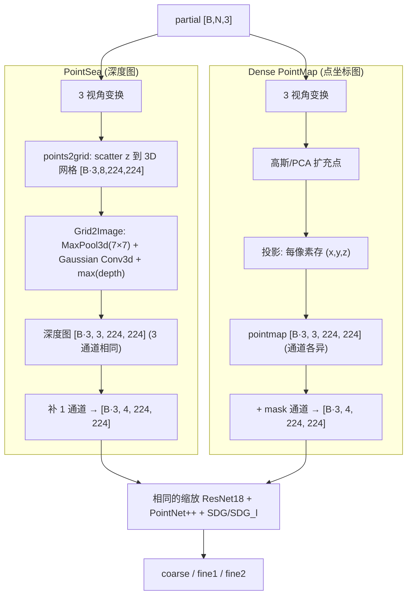

# Dense PointMap 点云补全：网络设计与训练流程

本文档描述 **Dense PointMap** 方法的神经网络设计与训练流程，并与 **PointSea**（深度图自投影）做对照。

---

## 1. 方法总览

两者的**主干网络完全相同**（PointNet++ 点编码器 + 缩放 ResNet 图像编码器 + 注意力融合 + 两级 SDG 细化器），
**唯一区别在于自投影（self-projection）的输入表示**：

| | PointSea | Dense PointMap |
|---|---|---|
| 投影产物 | 深度图 `[B,3,H,W]`（3 通道均为同一深度值） | 点坐标图 `[B,3,H,W]`（x,y,z 各不相同） |
| 第 4 通道 | 恒为 1 的占位通道 | 原始/扩充点 mask（1=原始点，0=扩充点） |
| 稀疏性处理 | `points2grid` + `Grid2Image`（MaxPool3d+Gaussian 稠密化） | 高斯混合扩充 / PCA 切平面扩充 |
| 信息量 | 仅深度（丢失 x,y 位置） | 完整 3D 坐标 + mask |

---

## 2. 网络结构（Mermaid）



---

## 3. 自投影细节：Dense PointMap



**稀疏性缓解**：原始 2048 点在 224×224 上仅约 0.5% 像素被占据；扩充到 M≈H×W 后填充率提升到 **35–45%**，
使 ResNet 能在大范围像素上做卷积。

---

## 4. 与 PointSea 的差异对照



**核心区别**：
- **PointSea** 把点云压成**深度标量**（每像素只有 1 个深度值，且 3 通道冗余），丢失了像素内点的 (x,y) 信息；
- **Dense PointMap** 保留**完整 3D 坐标**（每像素 (x,y,z) 各异），并用 **mask** 区分原始点与扩充点。

---

## 5. 训练流程（Mermaid 时序）

```mermaid
sequenceDiagram
    participant DL as DataLoader
    participant P as 投影
    participant M as Model
    participant L as Loss
    participant OPT as Optimizer

    loop 每个 epoch (30)
        loop 每个 batch (bz=12)
            DL->>P: partial [B,2048,3]
            P->>M: pointmap+mask [B·3,4,224,224]
            M->>M: ResNet(图像) + PointNet++(点) + 融合 + SDG 两级
            M->>L: (coarse, fine1, fine2)
            L->>L: 三层对称 L1 CD (pytorch3d) vs 下采样 GT
            L-->>OPT: backward + clip_grad_norm(10) + step
            Note over L: NaN/Inf 输出/梯度/权重检测并跳过
        end
        M->>M: eval 模式跑 val(800) → CD/DCD/F1
        Note over M: 保存 best val CD 的 checkpoint
    end
```

**训练超参**（当前实验）：
- 模型：缩放版（5.0M 参数，全模型 64.1M 的 ~1/12）
- batch size 12，lr 1e-4 (Adam)，warmup 300 步
- `merge_points=256`（attention 序列减半以提速）
- 损失：`get_loss`（原版 Completion3D 协议，三层对称 L1 CD）
- 30 epoch，~10–12h/方法（GTX 1070）

---

## 6. 评测结果（val 800 样本，best checkpoint）

| 方法 | CD(×1000) ↓ | DCD ↓ | F1 ↑ | best epoch |
|------|-------------|-------|------|-----------|
| PointSea (深度图) | 26.99 | 0.725 | 0.212 | 11 |
| **Dense PointMap** | **18.72** | **0.677** | **0.318** | 25 |

Dense PointMap 的 CD 低 31%、F1 高 50%，且泛化更稳定（PointSea 第 11 epoch 后过拟合）。
